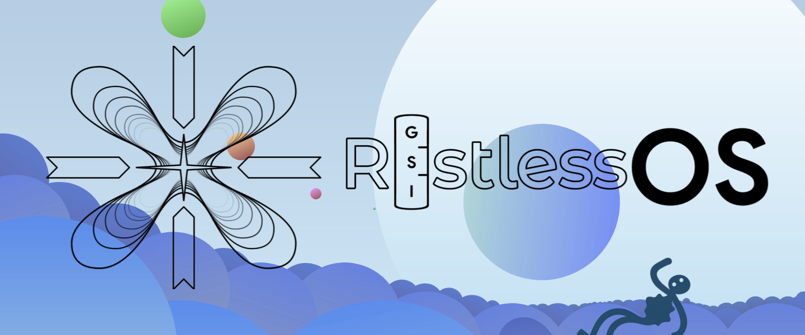

# restlessos_treble_wallpapers_stuff

This repository contains all the artwork, wallpapers, bootanimation and related content created by @Ziednaga or other users for the RestlessOS Treble GSI project, maintained by @cawilliamson.

This repository serves purely as a "photo gallery" for these visual assets and the new releases. You can download individual wallpapers by browsing the repository folders and clicking the file you want, then using the Download raw file button on GitHub.

All artwork, wallpapers, and visual content created by @Ziednaga or other users who wish to host their creations in this repository are licensed under the Creative Commons Attribution-NonCommercial 4.0 International (CC BY-NC 4.0) license.

Shared authorship: This content is distributed under shared authorship with the RestlessOS maintainer, @cawilliamson, as part of the RestlessOS Treble GSI project.

For further details, please refer to the License.txt file.
