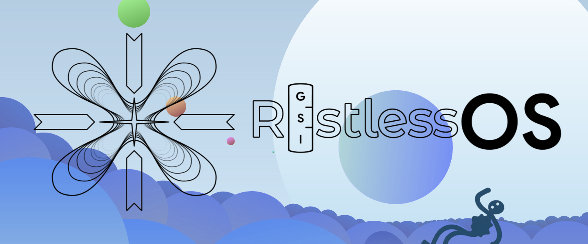

# restlessos_treble_wallpapers_stuff


This repository contains all the original and official artwork, wallpapers, bootanimations and related content created by @Ziednaga or other users for the RestlessOS Treble GSI project, maintained by @cawilliamson.
This repository serves purely as a "photo gallery" for these visual assets and new releases. You can download individual wallpapers by browsing the repository folders and clicking the file you want, then using the Download raw file button on GitHub.

## Contributing
Community contributions are welcome. If you want to submit your own wallpapers, please read the CONTRIBUTING.md before opening a Pull Request.
Community wallpapers live under:
```
Wallpapers/Community/
```
With an example of AUTHOR.TXT file.

## License
All artwork, wallpapers, and visual content created by @Ziednaga or other users who wish to host their creations in this repository are licensed under the Creative Commons Attribution-NonCommercial 4.0 International (CC BY-NC 4.0) license.
Shared authorship: This content is distributed under shared authorship with the RestlessOS maintainer, @cawilliamson, as part of the RestlessOS Treble GSI project.

For further details, please refer to the License.txt file.

```
Branding exception: 

The RestlessOS name, 
logo, and all visual identity 
assets located in the Branding/ 
directory are All Rights 
Reserved by @Ziednaga, 
@cawilliamson and The RestlessOS GSI Project. 

You may freely use and adapt 
these assets solely for content 
directly related to RestlessOS 
(such as wallpapers, bootanimations, themes, or community material). 
Forks and derivative projects 
must use their own branding. 
Any other use requires explicit 
written permission from @Ziednaga 
and @cawilliamson. 

See Branding/License.txt for details.
```

## Main Repository
Please take a look at the main repository of RestlessOS:
https://github.com/cawilliamson/treble_restlessos
